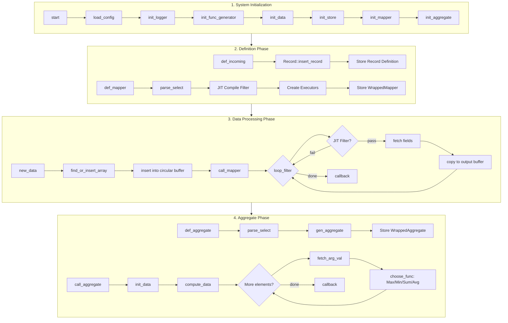
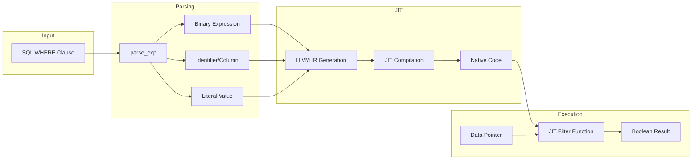
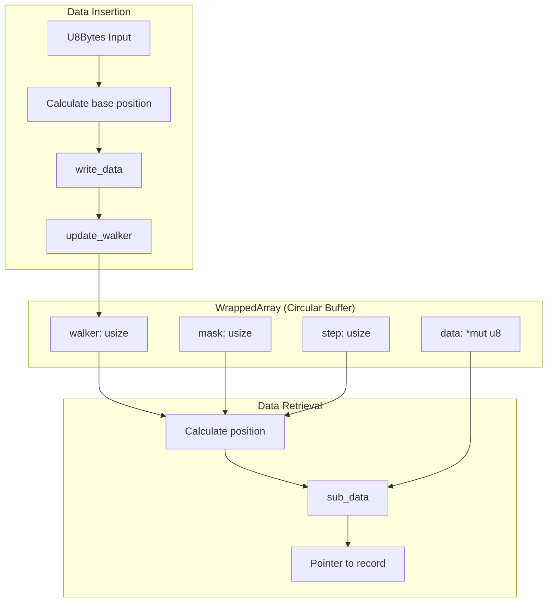
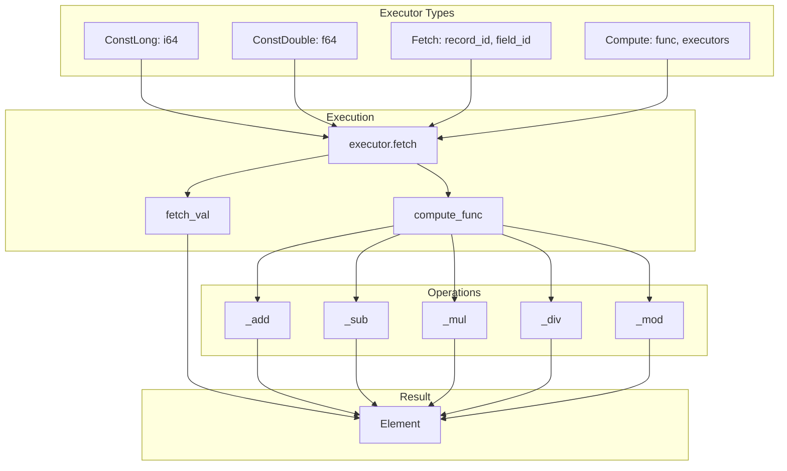

# Bamboo Pipe Engine - Core Data Flow

## Overview

BPE processes streaming data through a pipeline of: **Definition → Ingestion → JIT Filtering → Callback Execution**.

## Main Data Flow

## JIT Filter Compilation Flow

## Circular Buffer Data Flow

## Executor Execution Flow

## Key Data Structures

| Structure | Purpose | Size |
|-----------|---------|------|
| `U8Bytes` | Fixed-size data record container | 512 bytes (default) |
| `WrappedArray` | Circular buffer for record storage | Configurable |
| `Record` | Schema definition for data records | Variable |
| `Mapper` | SQL query processor with JIT filter | Variable |
| `Executor` | Expression evaluation tree node | Variable |
| `Element` | Typed value (Long/Double) | 8 bytes |

## Performance Characteristics

- **JIT Filter**: Nanosecond-level latency after compilation
- **Circular Buffer**: O(1) insertion and access
- **Zero-copy**: Direct pointer access to data
- **Cache-friendly**: Contiguous memory layout