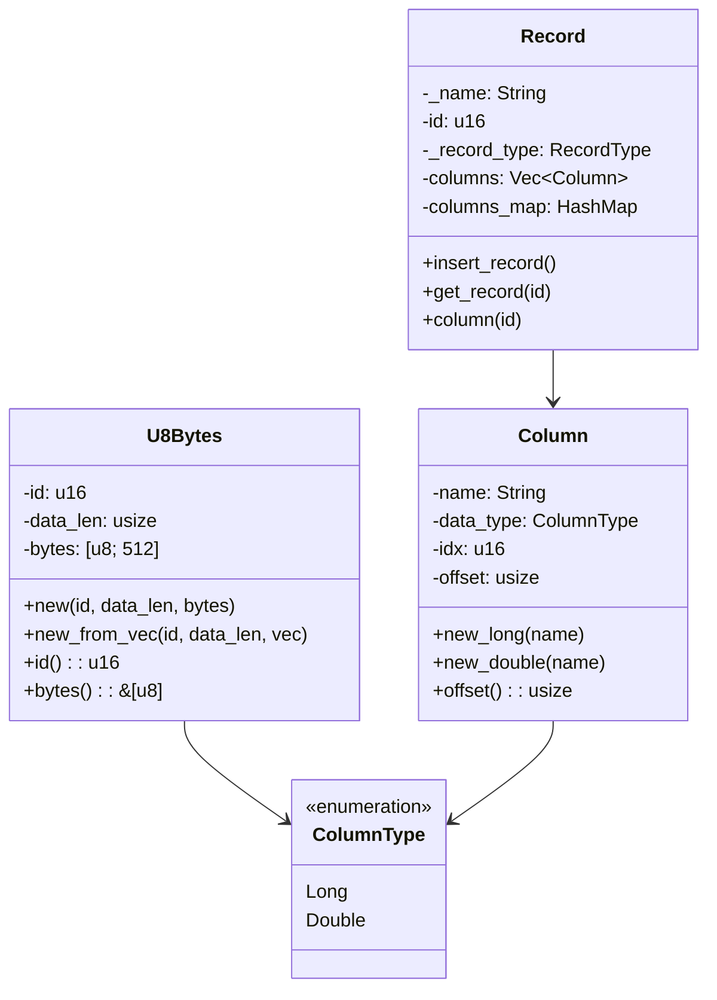
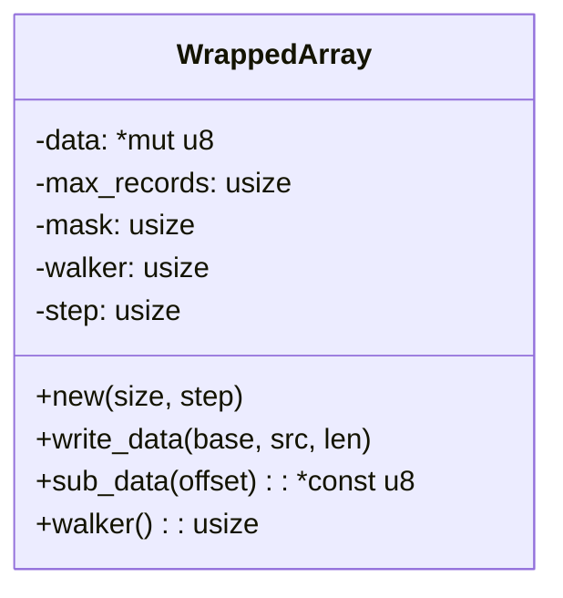
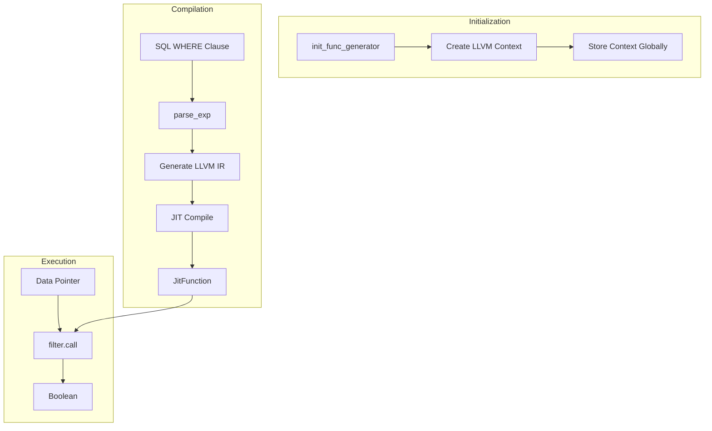
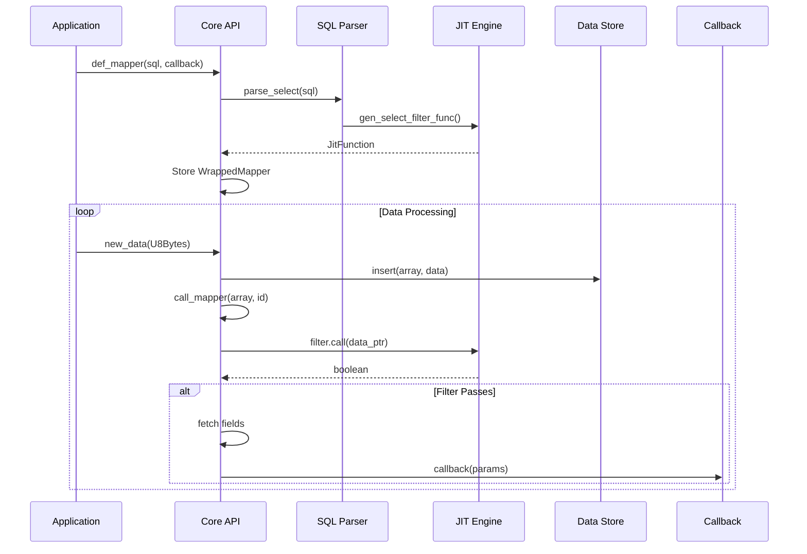
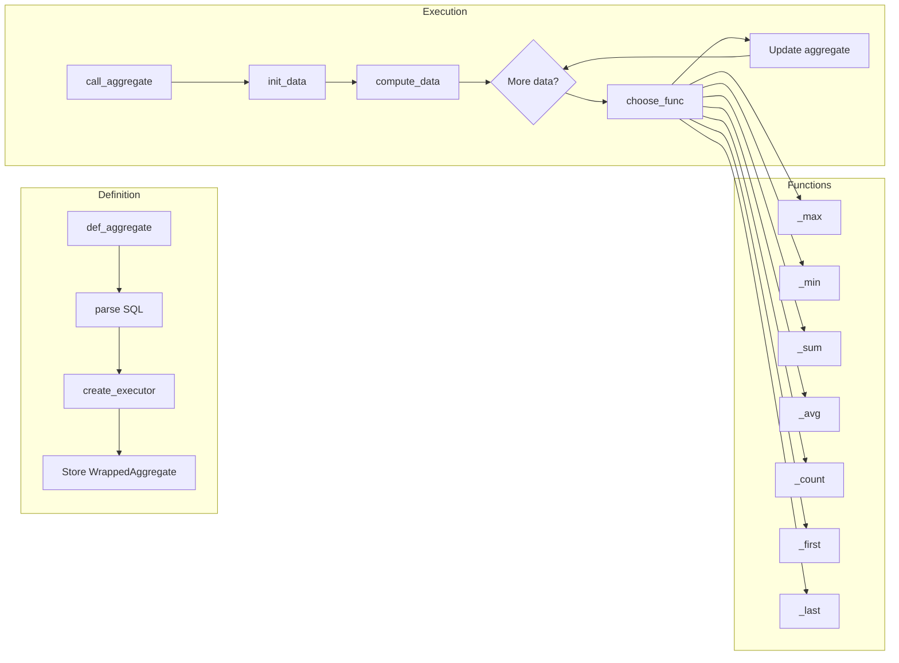
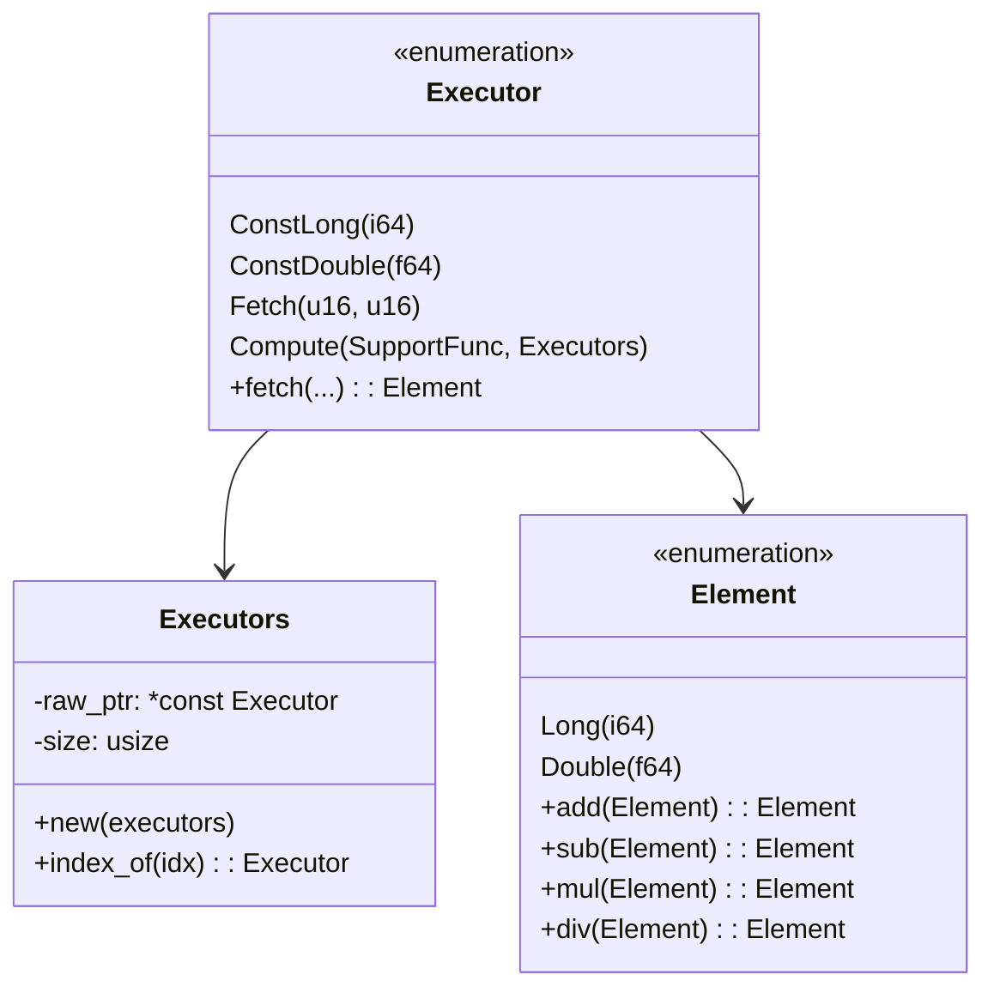

# BPE-Core 模块设计文档

## 1. 模块概述

`bpe-core` 是 Bamboo Pipe Engine 的核心模块，提供流式数据处理的完整实现，包括：

- SQL 解析与 JIT 编译
- 环形缓冲区数据存储
- 纳秒级延迟的数据过滤
- 聚合函数计算

## 2. 模块结构

```
bpe-core/src/
├── lib.rs           # 模块入口，公共API导出
├── core.rs          # 系统生命周期管理
├── data.rs          # 数据模型定义
├── store.rs         # 环形缓冲区存储
├── mapper.rs        # SQL映射器
├── aggregate.rs     # 聚合函数处理
├── exec.rs          # 表达式执行器
├── element.rs       # 值类型封装
├── callback.rs      # 回调函数容器
├── param.rs         # 回调参数
├── jit/             # JIT编译模块
│   ├── base.rs      # LLVM基础设施
│   ├── filter.rs    # 过滤器生成
│   ├── aux.rs       # 辅助函数
│   └── consts.rs    # 常量定义
├── sql/             # SQL解析模块
│   ├── base.rs      # 解析基础设施
│   └── select.rs    # SELECT语句解析
├── calc_func.rs     # 计算函数
├── agg_func.rs      # 聚合函数
├── func_enum.rs     # 支持函数枚举
├── aux.rs           # 辅助工具
├── cfg.rs           # 配置管理
├── consts.rs        # 全局常量
├── id.rs            # ID生成器
├── error.rs         # 错误类型
├── ffi.rs           # FFI接口
├── logger.rs        # 日志系统
└── macros.rs        # 宏定义
```

## 3. 核心组件设计

### 3.1 数据模型 (data.rs)



**设计要点：**
- `U8Bytes` 使用固定大小数组（默认512字节），避免动态分配
- `Column` 预计算偏移量，运行时零开销访问
- `Record` 使用 `columns_map` 实现O(1)列名查找

### 3.2 存储层 (store.rs)



**设计要点：**
- 环形缓冲区设计，无锁写入
- 使用 `mask` 实现快速取模：`position & mask`
- `walker` 追踪写入位置，支持覆盖最旧数据
- 直接裸指针操作，零拷贝数据访问

### 3.3 JIT编译引擎 (jit/)



**设计要点：**
- LLVM Context 全局单例，避免重复创建
- WHERE子句编译为原生机器码
- 支持的类型：整数、浮点、布尔
- 支持的操作：比较(==,!=,>,<,>=,<=)、逻辑(&&,||)

### 3.4 SQL映射器 (mapper.rs)



**设计要点：**
- SQL解析后生成 `Mapper` 结构
- `WrappedMapper` 持有 `Mapper` 和回调函数
- `loop_filter` 遍历环形缓冲区，应用JIT过滤器
- 支持升序/降序、LIMIT限制

### 3.5 聚合函数 (aggregate.rs)



**设计要点：**
- 支持Long和Double类型的聚合
- `init_data` 初始化聚合状态（如Max初始化为MIN）
- 增量计算，避免全量遍历
- 内存布局优化，缓存友好

### 3.6 执行器 (exec.rs)



**设计要点：**
- 表达式树结构，支持嵌套计算
- `Executors` 使用裸指针存储，避免Vec开销
- `Element` 提供类型安全的运算

## 4. 性能优化策略

### 4.1 内存布局
- 固定大小数据结构（`U8Bytes`）
- 预计算列偏移量
- 环形缓冲区连续内存

### 4.2 零拷贝
- 直接指针访问数据
- JIT函数直接操作内存
- 避免序列化/反序列化

### 4.3 内联优化
- 热点函数使用 `#[inline]`
- JIT编译器内联优化
- 循环展开

### 4.4 缓存友好
- 连续内存布局
- 缓存行对齐（待优化）
- 数据预取（待优化）

## 5. 线程安全

- 使用 `std::sync::Once` 保证初始化安全
- 全局状态使用 `static mut` + `globalvar` crate
- 回调函数要求 `Send` bound

## 6. 错误处理

- 核心路径使用 `unwrap()` 假设不变量
- 可恢复错误使用 `log::warn!`
- JIT编译失败使用 `panic!`

## 7. 扩展点

- 新增计算函数：扩展 `SupportFunc` 枚举
- 新增聚合函数：扩展 `agg_func.rs`
- 新增SQL语法：扩展 `sql/select.rs`