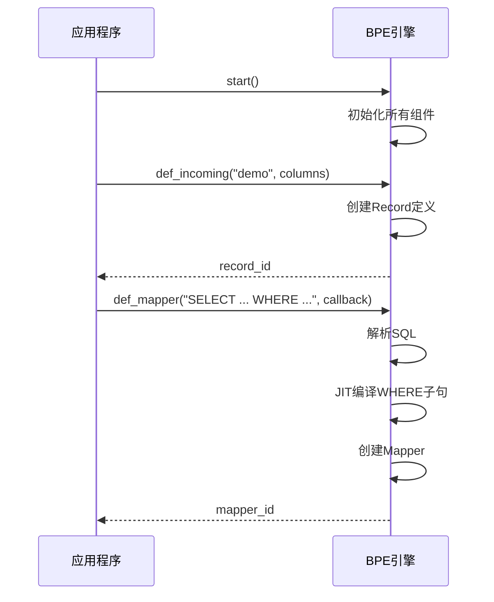
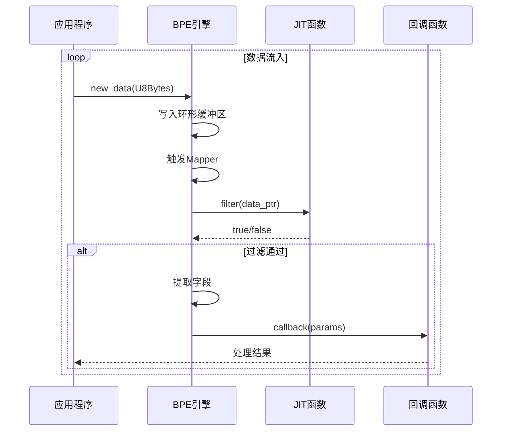
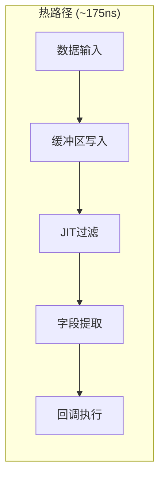
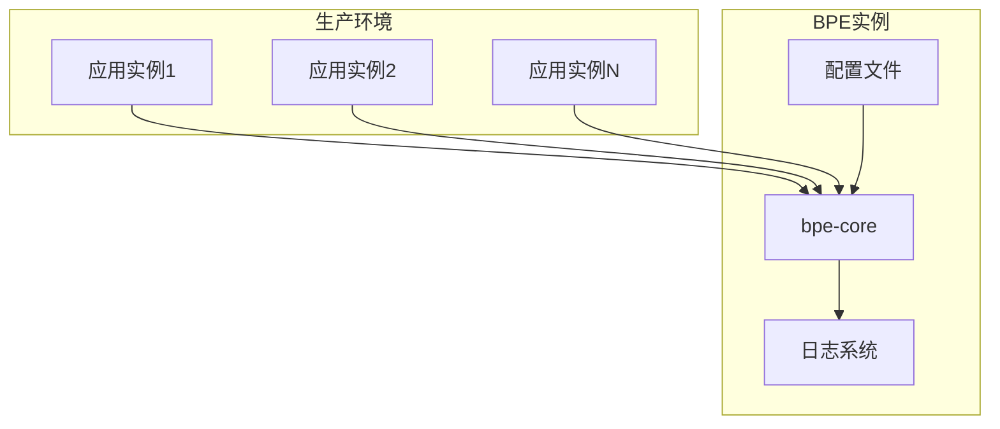

# Bamboo Pipe Engine - 全局设计文档

## 1. 项目概述

### 1.1 定位

Bamboo Pipe Engine (BPE) 是一个**高性能单表流式数据处理引擎**，具有以下特点：

- **SQL驱动**：使用SQL语法定义数据过滤和提取规则
- **JIT编译**：过滤条件编译为原生机器码，纳秒级延迟
- **单表架构**：专注于单表流处理，不支持JOIN
- **多语言绑定**：支持Rust、Java、Python

### 1.2 核心目标

| 目标 | 指标 |
|------|------|
| 延迟 | 纳秒级（~175ns/op） |
| 吞吐 | 百万级记录/秒/核心 |
| 内存 | 固定大小，无动态分配 |
| API | 简洁稳定，向后兼容 |

## 2. 系统架构

### 2.1 整体架构图

```mermaid
flowchart TB
    subgraph External["外部系统"]
        JAVA[Java应用]
        PYTHON[Python应用]
        RUST[Rust应用]
    end
    
    subgraph API["公共API层"]
        DEF[def_incoming/def_stream]
        MAP[def_mapper]
        AGG[def_aggregate]
        NEW[new_data]
    end
    
    subgraph Core["核心引擎 bpe-core"]
        SQL[SQL解析器]
        JIT[JIT编译器]
        STORE[环形缓冲区]
        EXEC[执行器]
    end
    
    subgraph Storage["数据存储"]
        BUF[WrappedArray]
        REC[Record定义]
    end
    
    JAVA --> API
    PYTHON --> API
    RUST --> API
    
    DEF --> REC
    MAP --> SQL --> JIT --> EXEC
    NEW --> STORE --> BUF
    EXEC --> BUF
    EXEC --> STORE
```



### 2.2 模块划分

| 模块 | 职责 | 依赖 |
|------|------|------|
| `bpe-core` | 核心引擎 | LLVM, sql-parse |
| `bpe-java-wrapper` | Java JNI绑定 | bpe-core, JNI |
| `bpe-py-wrapper` | Python PyO3绑定 | bpe-core, PyO3 |
| `bpe-sample` | 示例程序 | bpe-core |
| `bpe-test` | 集成测试 | bpe-core |

## 3. 数据流设计

### 3.1 定义阶段



### 3.2 运行阶段



## 4. 核心技术选型

### 4.1 JIT编译

- **框架**: LLVM (inkwell crate)
- **版本**: LLVM 19
- **优化级别**: Aggressive
- **输出**: 原生机器码

### 4.2 数据存储

- **结构**: 环形缓冲区 (Circular Buffer)
- **大小**: 可配置（默认1MB）
- **记录大小**: 可配置（默认512字节）
- **访问**: 直接指针，零拷贝

### 4.3 SQL解析

- **库**: sql-parse
- **支持**: SELECT, WHERE, LIMIT
- **不支持**: JOIN, GROUP BY, HAVING, ORDER BY

## 5. 性能设计

### 5.1 延迟优化



### 5.2 内存优化

- **固定分配**: 启动时预分配所有内存
- **无GC**: 不使用Rust的堆分配（核心路径）
- **内存池**: 环形缓冲区重用

### 5.3 并发设计

- **单线程**: 核心路径无锁
- **初始化**: `std::sync::Once` 保证安全
- **回调**: 要求 `Send` trait

## 6. 接口设计

### 6.1 公共API

```rust
// 生命周期
pub fn start();
pub fn stop();

// 定义
pub fn def_incoming(name: &str, columns: Vec<Column>) -> Option<u16>;
pub fn def_stream(name: &str, columns: Vec<Column>) -> Option<u16>;
pub fn def_mapper<F>(sql: &str, func: F) -> Option<u16>;
pub fn def_aggregate<F>(sql: &str, func: F) -> Option<u16>;

// 数据处理
pub fn new_data(data: &U8Bytes) -> bool;

// 类型
pub struct Column { ... }
pub struct U8Bytes { ... }
pub struct CallbackParams { ... }
```

### 6.2 SQL语法

```sql
SELECT field1, field2, _func(field3)
FROM record_name
WHERE field1 > 0 AND field2 < 100
LIMIT 100
```

**支持：**
- 字段引用：`field`, `table.field`
- 字面量：整数、浮点
- 运算符：`+`, `-`, `*`, `/`, `%`
- 比较：`=`, `!=`, `>`, `<`, `>=`, `<=`
- 逻辑：`AND`, `OR`
- 函数：`_add`, `_sub`, `_mul`, `_div`, `_mod`
- 聚合：`_maxl`, `_minl`, `_suml`, `_count`, `_avgl`, `_firstl`, `_lastl`

## 7. 扩展机制

### 7.1 新增函数

1. 在 `func_enum.rs` 添加枚举变体
2. 在 `calc_func.rs` 或 `agg_func.rs` 实现函数
3. 在 `exec.rs` 或 `aggregate.rs` 添加分发逻辑

### 7.2 新增数据类型

1. 在 `ColumnType` 添加新类型
2. 更新 `Column::copy_from_columns` 偏移计算
3. 更新 JIT 函数注册

### 7.3 新增语言绑定

1. 创建新的 wrapper crate
2. 使用 FFI (C ABI) 或语言特定绑定库
3. 实现 `FfiFunc` trait

## 8. 部署架构



## 9. 监控与可观测性

- **日志**: log4rs，可配置级别
- **指标**: 纳秒级延迟测量
- **健康检查**: `stop()` 标记状态

## 10. 安全考虑

- **内存安全**: Rust 所有权系统
- **FFI安全**: `unsafe` 块最小化
- **输入验证**: SQL解析器拒绝危险语句