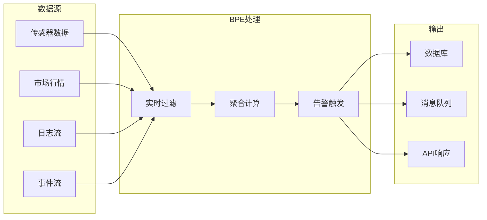
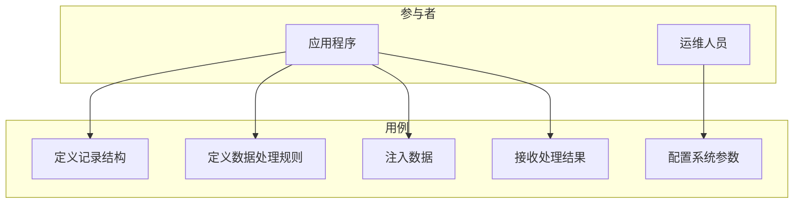

# Bamboo Pipe Engine - 全局需求文档

## 1. 项目愿景

### 1.1 核心定位

Bamboo Pipe Engine (BPE) 是一个**高性能单表流式数据处理引擎**，专注于为实时数据流提供纳秒级延迟的过滤和聚合能力。

### 1.2 目标用户

| 用户类型 | 使用场景 |
|----------|----------|
| 金融交易系统 | 实时行情过滤、异常检测 |
| 物联网平台 | 传感器数据流处理 |
| 日志分析系统 | 实时日志过滤 |
| 游戏服务器 | 玩家事件处理 |

## 2. 业务需求

### 2.1 核心业务场景

### 2.2 业务需求列表

| ID | 需求描述 | 优先级 |
|----|----------|--------|
| BIZ-001 | 实时过滤数据流，延迟<1μs | 高 |
| BIZ-002 | 支持SQL语法定义过滤规则 | 高 |
| BIZ-003 | 支持聚合计算（最大、最小、平均等） | 高 |
| BIZ-004 | 支持多语言集成（Rust/Java/Python） | 中 |
| BIZ-005 | 低内存占用，适合嵌入式部署 | 中 |
| BIZ-006 | 配置化部署，无需修改代码 | 低 |

## 3. 功能需求

### 3.1 数据定义功能

| ID | 功能 | 描述 | 优先级 |
|----|------|------|--------|
| F-001 | 记录定义 | 支持定义数据记录结构 | 高 |
| F-002 | 列类型 | 支持64位整数和双精度浮点 | 高 |
| F-003 | 记录命名 | 支持通过名称引用记录 | 高 |

### 3.2 数据处理功能

| ID | 功能 | 描述 | 优先级 |
|----|------|------|--------|
| F-010 | 数据注入 | 支持将数据注入处理管道 | 高 |
| F-011 | 实时过滤 | 根据WHERE子句过滤数据 | 高 |
| F-012 | 字段提取 | 提取SELECT指定的字段 | 高 |
| F-013 | 结果限制 | 支持LIMIT限制结果数量 | 中 |

### 3.3 查询功能

| ID | 功能 | 描述 | 优先级 |
|----|------|------|--------|
| F-020 | SQL解析 | 解析SELECT语句 | 高 |
| F-021 | 比较运算 | 支持=, !=, >, <, >=, <= | 高 |
| F-022 | 逻辑运算 | 支持 AND, OR | 高 |
| F-023 | 算术运算 | 支持 +, -, *, /, % | 中 |
| F-024 | 内置函数 | 支持聚合和计算函数 | 中 |

### 3.4 聚合功能

| ID | 功能 | 描述 | 优先级 |
|----|------|------|--------|
| F-030 | 最大值 | _maxl, _maxd | 高 |
| F-031 | 最小值 | _minl, _mind | 高 |
| F-032 | 求和 | _suml, _sumd | 高 |
| F-033 | 计数 | _count | 高 |
| F-034 | 平均值 | _avgl, _avgd | 中 |
| F-035 | 首值 | _firstl, _firstd | 中 |
| F-036 | 末值 | _lastl, _lastd | 中 |

### 3.5 回调功能

| ID | 功能 | 描述 | 优先级 |
|----|------|------|--------|
| F-040 | Rust回调 | 支持Rust闭包 | 高 |
| F-041 | FFI回调 | 支持跨语言调用 | 中 |
| F-042 | 聚合绑定 | Mapper绑定聚合函数 | 中 |

## 4. 非功能需求

### 4.1 性能需求

| ID | 需求 | 目标值 | 验收方法 |
|----|------|--------|----------|
| NF-001 | 端到端延迟 | < 1μs (99.9%) | 基准测试 |
| NF-002 | 过滤延迟 | < 500ns | 基准测试 |
| NF-003 | 吞吐量 | > 100万/秒/核心 | 压力测试 |
| NF-004 | JIT编译时间 | < 10ms | 性能测试 |

### 4.2 可靠性需求

| ID | 需求 | 目标值 |
|----|------|--------|
| NF-010 | 内存安全 | 无内存泄漏、无野指针 |
| NF-011 | 崩溃恢复 | 核心路径无panic |
| NF-012 | 数据一致性 | 无数据丢失或损坏 |

### 4.3 可用性需求

| ID | 需求 | 目标值 |
|----|------|--------|
| NF-020 | API学习曲线 | < 1小时 |
| NF-021 | 错误提示 | 清晰的错误信息 |
| NF-022 | 文档完整性 | API文档覆盖100% |

### 4.4 兼容性需求

| ID | 需求 | 目标 |
|----|------|------|
| NF-030 | Rust版本 | 1.70+ |
| NF-031 | LLVM版本 | 19.x |
| NF-032 | 操作系统 | Linux x86_64 |
| NF-033 | Java版本 | 8+ |
| NF-034 | Python版本 | 3.8+ |

## 5. 约束条件

### 5.1 架构约束

| ID | 约束 | 原因 |
|----|------|------|
| C-001 | 单表架构 | 性能优化优先，多表JOIN由应用层处理 |
| C-002 | 单线程核心 | 避免锁竞争，最大化性能 |
| C-003 | 固定内存 | 避免GC和动态分配 |

### 5.2 技术约束

| ID | 约束 | 原因 |
|----|------|------|
| C-010 | LLVM依赖 | JIT编译需要 |
| C-011 | 不支持动态Schema | 性能考虑 |

## 6. 用例模型

### 6.1 核心用例

### 6.2 用例描述

#### UC-001 定义记录结构

| 项目 | 描述 |
|------|------|
| 参与者 | 应用程序 |
| 前置条件 | 系统已启动 |
| 主流程 | 1. 调用 def_incoming 或 def_stream 2. 指定记录名和列定义 3. 获取记录ID |
| 后置条件 | 记录已注册，可用于数据处理 |
| 异常流程 | 记录名重复 → 警告日志 |

#### UC-002 定义数据处理规则

| 项目 | 描述 |
|------|------|
| 参与者 | 应用程序 |
| 前置条件 | 记录已定义 |
| 主流程 | 1. 调用 def_mapper 2. 提供SQL语句和回调函数 3. SQL解析和JIT编译 4. 获取Mapper ID |
| 后置条件 | Mapper已注册，新数据将触发处理 |
| 异常流程 | SQL语法错误 → 返回None |

#### UC-003 注入数据

| 项目 | 描述 |
|------|------|
| 参与者 | 应用程序 |
| 前置条件 | 记录已定义，Mapper已注册 |
| 主流程 | 1. 构造U8Bytes数据 2. 调用 new_data 3. 数据写入缓冲区 4. 触发相关Mapper 5. 执行JIT过滤 6. 调用回调函数 |
| 后置条件 | 数据已处理，回调已执行 |

## 7. 验收标准

### 7.1 功能验收

- [ ] 所有功能需求实现完成
- [ ] 单元测试覆盖率 > 80%
- [ ] 集成测试通过
- [ ] 示例程序运行正常

### 7.2 性能验收

- [ ] 延迟满足NF-001~004
- [ ] 吞吐量满足NF-003
- [ ] 内存占用稳定

### 7.3 文档验收

- [ ] API文档完整
- [ ] 使用指南完整
- [ ] 设计文档完整

## 8. 版本规划

| 版本 | 功能 | 状态 |
|------|------|------|
| v0.1 | 核心过滤功能 | 已完成 |
| v0.2 | 聚合功能 | 已完成 |
| v0.3 | 多语言绑定 | 开发中 |
| v0.4 | 性能优化 | 计划中 |
| v1.0 | 生产就绪 | 计划中 |