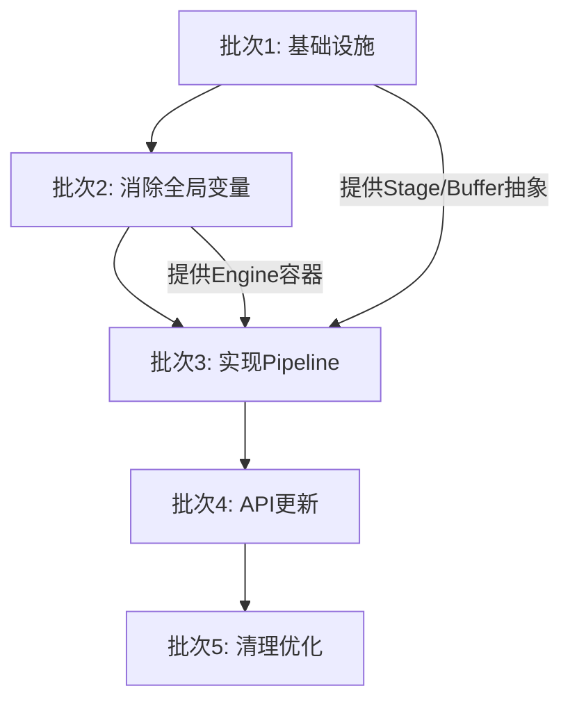

# BPE项目重构计划

> **状态**: 待办（讨论阶段）
> **日期**: 2026-04-02
> **决策**: 尚未确定是否实施链式聚合，当前聚焦单步处理场景

---

## 一、问题识别与分析

### 1.1 信号识别清单

基于代码审查，识别以下退化信号：

#### 类型退化信号

| 信号 | 位置 | 模式 | 严重程度 |
|------|------|------|----------|
| 字符串判断类型 | `aggregate.rs:282-389` | match func { MaxL => ... } | 中 |
| 枚举退化 | `func_enum.rs` | SupportFunc枚举仅用于分发 | 低 |

#### 数据退化信号

| 信号 | 位置 | 模式 | 严重程度 |
|------|------|------|----------|
| 全局缓冲区 | `aggregate.rs:37` | PTR_VAL_DATA_REF单一缓冲区 | **高** |
| Map查找重复 | `store.rs:48-53` | entry + get_mut双重查找 | 中 |

#### 关系退化信号

| 信号 | 位置 | 模式 | 严重程度 |
|------|------|------|----------|
| 全局变量依赖 | `core.rs`, `store.rs`, `aggregate.rs` | static mut + globalvar | **高** |
| Mapper与Aggregate紧耦合 | `core.rs:95-104` | 绑定时创建闭包，无法链式 | **高** |

#### 行为退化信号

| 信号 | 位置 | 模式 | 严重程度 |
|------|------|------|----------|
| 重复列偏移计算 | `aggregate.rs` (已优化) | 循环内计算 | 低（已解决） |
| 重复match分发 | `aggregate.rs:282-389` | choose_func双match | 中 |

---

### 1.2 三问法分析

#### 核心问题：不支持聚合链

**Q1: 为什么会出现这个问题？**

```
根本原因：
1. 设计之初假设单一聚合场景
2. 使用全局缓冲区PTR_VAL_DATA_REF（单一实例）
3. Aggregate的输入来自Mapper，输出直接给Callback
4. 没有定义Aggregate间的数据流转机制
```

**Q2: 这个问题的本质是什么？**

```
本质分类：
- 数据退化：全局缓冲区限制了数据流的灵活性
- 关系退化：Mapper与Aggregate是1:1绑定，缺少Pipeline抽象
- 设计限制：流式处理引擎需要DAG（有向无环图）支持，当前是线性结构
```

**Q3: 正确的设计应该是什么？**

```
目标设计：
1. 引入Pipeline抽象，支持DAG拓扑
2. 每个节点独立缓冲区，避免全局状态
3. 定义节点间数据流转协议
4. 支持串联和并联两种模式
```

---

### 1.3 影响评估

| 维度 | 当前状态 | 影响 |
|------|----------|------|
| **功能** | 无法实现多阶段聚合 | 业务场景受限 |
| **性能** | 全局缓冲区竞争 | 多Mapper场景性能下降 |
| **可维护性** | 全局变量散落各处 | 难以追踪数据流 |
| **可测试性** | 全局状态难以模拟 | 单元测试困难 |
| **可扩展性** | 硬编码数据流 | 新功能需要大改 |

---

## 二、重构目标

### 2.1 核心目标

```
目标：支持 data → mapper → agg1 → agg2 → ... → callback 的链式处理
```

### 2.2 具体指标

| 维度 | 当前 | 目标 | 收益 |
|------|------|------|------|
| 聚合链深度 | 1 | N (可配置) | 支持复杂业务场景 |
| 全局变量数 | 6个 | 0个 | 可测试性提升 |
| 节点耦合度 | 紧耦合 | 松耦合 | 可扩展性提升 |
| 性能基准 | ~156ns | 保持 | 不退化 |

---

## 三、重构方案设计

### 3.1 架构重构

#### 方案对比

| 方案 | 描述 | 优点 | 缺点 | 推荐度 |
|------|------|------|------|--------|
| **方案A：Pipeline模式** | 定义Pipeline接口，节点可串联 | 灵活、可配置 | 改动较大 | ★★★★★ |
| **方案B：装饰器模式** | Aggregate包装Aggregate | 改动小 | 不够直观 | ★★★☆☆ |
| **方案C：事件总线** | 发布订阅模式 | 完全解耦 | 性能开销 | ★★☆☆☆ |

**推荐方案：Pipeline模式**

```
Pipeline设计：

┌─────────────────────────────────────────────────────────┐
│                     Pipeline                             │
│  ┌───────┐    ┌───────┐    ┌───────┐    ┌───────┐     │
│  │ Stage0│───▶│ Stage1│───▶│ Stage2│───▶│ StageN│     │
│  │Mapper │    │ Agg1  │    │ Agg2  │    │Output │     │
│  └───────┘    └───────┘    └───────┘    └───────┘     │
│      ↓            ↓            ↓            ↓          │
│   Buffer0      Buffer1      Buffer2      BufferN       │
└─────────────────────────────────────────────────────────┘

每个Stage：
- 独立Buffer（消除全局状态）
- 定义Input/Output类型
- 支持process()方法
```

---

### 3.2 核心接口设计

```rust
/// Pipeline Stage接口
pub trait Stage: Send {
    /// 处理输入数据，产生输出
    fn process(&mut self, input: &Buffer, output: &mut Buffer) -> usize;
    
    /// 输出Buffer大小
    fn output_size(&self) -> usize;
}

/// Pipeline定义
pub struct Pipeline {
    stages: Vec<Box<dyn Stage>>,
    buffers: Vec<Buffer>,
}

impl Pipeline {
    /// 添加Stage
    pub fn add_stage<S: Stage + 'static>(mut self, stage: S) -> Self {
        self.stages.push(Box::new(stage));
        self.buffers.push(Buffer::new(stage.output_size()));
        self
    }
    
    /// 执行Pipeline
    pub fn execute(&mut self, input: &Buffer) -> &Buffer {
        let mut current = input;
        for (stage, buffer) in self.stages.iter_mut().zip(self.buffers.iter_mut()) {
            stage.process(current, buffer);
            current = buffer;
        }
        current
    }
}

/// Buffer抽象（替代全局PTR_VAL_DATA_REF）
pub struct Buffer {
    data: Vec<u8>,
    size: usize,
}
```

---

### 3.3 消除全局变量

**当前全局变量清单**：

| 变量 | 位置 | 用途 | 重构方案 |
|------|------|------|----------|
| PTR_MAP | store.rs | Record存储Map | 封装到StoreManager |
| PTR_MAPPER_MAP | mapper.rs | Mapper注册表 | 封装到MapperRegistry |
| PTR_AGGREGATE_MAP | aggregate.rs | Aggregate注册表 | 封装到AggregateRegistry |
| PTR_VAL_DATA_REF | aggregate.rs | 聚合数据缓冲区 | 移除，改用Buffer |
| PTR_PARSE_OPTIONS | aggregate.rs | SQL解析选项 | 封装到SqlParser |
| VEC_SIZE/RECORD_SIZE | store.rs | 配置参数 | 封装到Config |

**重构后结构**：

```rust
/// BPE引擎（替代全局状态）
pub struct BpeEngine {
    config: Config,
    store: StoreManager,
    mappers: MapperRegistry,
    aggregates: AggregateRegistry,
    pipelines: PipelineRegistry,
}

impl BpeEngine {
    pub fn new(config: Config) -> Self { ... }
    
    pub fn def_incoming(&mut self, name: &str, columns: Vec<Column>) -> Option<u16> {
        self.store.def_record(name, RecordType::Incoming, columns)
    }
    
    pub fn new_data(&mut self, data: &U8Bytes) -> bool {
        let array = self.store.find_or_create(data.id());
        self.store.insert(array, data);
        self.mappers.trigger(data.id(), array);
        true
    }
    
    pub fn def_pipeline(&mut self, stages: Vec<StageDef>) -> Option<u16> {
        let pipeline = PipelineBuilder::new()
            .add_stages(stages)
            .build();
        self.pipelines.register(pipeline)
    }
}
```

---

### 3.4 API设计

**新增API（保持向后兼容）**：

```rust
// 原有API保持不变
pub fn def_incoming(name: &str, columns: Vec<Column>) -> Option<u16>;
pub fn def_stream(name: &str, columns: Vec<Column>) -> Option<u16>;
pub fn def_mapper<F>(sql: &str, func: F) -> Option<u16>;
pub fn def_mapper_bind_aggregate(sql: &str, aggregate_id: u16) -> Option<u16>;
pub fn def_aggregate<F>(sql: &str, func: F) -> Option<u16>;
pub fn new_data(data: &U8Bytes) -> bool;

// 新增Pipeline API
pub fn def_pipeline(sql: &str, chain: Vec<u16>) -> Option<u16>;
// 示例：
// let agg1 = def_aggregate("SELECT _suml(stream.a) FROM stream", |p| {})?;
// let agg2 = def_aggregate("SELECT _avg(stream.a) FROM stream", |p| {})?;
// let pipeline = def_pipeline("SELECT * FROM demo WHERE ...", vec![agg1, agg2])?;
```

---

## 四、执行计划

### 4.1 分批策略

```
批次1：基础设施重构
  ├── 引入Buffer抽象
  ├── 引入Stage trait
  ├── 引入Pipeline结构
  └── 单元测试验证

批次2：消除全局变量
  ├── 引入BpeEngine结构
  ├── 重构store模块
  ├── 重构mapper模块
  └── 重构aggregate模块

批次3：实现Pipeline
  ├── 实现MapperStage
  ├── 实现AggregateStage
  ├── 实现OutputStage
  └── 集成测试

批次4：API更新
  ├── 新增def_pipeline API
  ├── 更新文档
  ├── 性能基准测试
  └── 示例代码

批次5：清理与优化
  ├── 移除废弃代码
  ├── 性能调优
  ├── 文档完善
  └── 发布准备
```

---

### 4.2 详细任务清单

#### 批次1：基础设施重构（3-5天）

| 任务 | 文件 | 工作量 | 风险 |
|------|------|--------|------|
| 定义Buffer结构 | 新建 `buffer.rs` | 0.5天 | 低 |
| 定义Stage trait | 新建 `pipeline.rs` | 0.5天 | 低 |
| 实现Pipeline结构 | `pipeline.rs` | 1天 | 中 |
| 单元测试 | 新建 `pipeline_test.rs` | 1天 | 低 |

**产出**：
- `src/buffer.rs` - Buffer定义
- `src/pipeline.rs` - Pipeline框架
- `tests/pipeline_test.rs` - 测试用例

---

#### 批次2：消除全局变量（5-7天）

| 任务 | 文件 | 工作量 | 风险 |
|------|------|--------|------|
| 定义BpeEngine | 新建 `engine.rs` | 1天 | 中 |
| 重构store模块 | `store.rs` | 1天 | 高 |
| 重构mapper模块 | `mapper.rs` | 1天 | 高 |
| 重构aggregate模块 | `aggregate.rs` | 2天 | 高 |
| 兼容性适配 | `core.rs`, `lib.rs` | 1天 | 中 |

**风险缓解**：
- 保持公共API不变
- 内部全局变量作为适配层
- 每次修改后运行完整测试

**产出**：
- `src/engine.rs` - 引擎核心
- 重构后的 `store.rs`, `mapper.rs`, `aggregate.rs`

---

#### 批次3：实现Pipeline（5-7天）

| 任务 | 文件 | 工作量 | 风险 |
|------|------|--------|------|
| 实现MapperStage | `pipeline/mapper_stage.rs` | 1天 | 中 |
| 实现AggregateStage | `pipeline/aggregate_stage.rs` | 1天 | 中 |
| 实现OutputStage | `pipeline/output_stage.rs` | 0.5天 | 低 |
| PipelineBuilder | `pipeline/builder.rs` | 1天 | 中 |
| 集成测试 | `tests/integration_test.rs` | 2天 | 中 |

**产出**：
- `src/pipeline/` 目录
- 集成测试用例

---

#### 批次4：API更新（3-5天）

| 任务 | 文件 | 工作量 | 风险 |
|------|------|--------|------|
| def_pipeline API | `core.rs` | 1天 | 低 |
| Java/Python绑定 | `bpe-java-wrapper`, `bpe-py-wrapper` | 1天 | 中 |
| 文档更新 | `README.md`, `doc/` | 1天 | 低 |
| 性能基准测试 | `benches/` | 1天 | 低 |
| 示例代码 | `bpe-sample/` | 0.5天 | 低 |

**产出**：
- 新API实现
- 多语言绑定
- 文档和示例

---

#### 批次5：清理与优化（2-3天）

| 任务 | 工作量 | 风险 |
|------|--------|------|
| 移除废弃代码 | 0.5天 | 低 |
| 性能调优 | 1天 | 中 |
| 最终文档 | 0.5天 | 低 |

---

### 4.3 依赖关系



---

## 五、风险与缓解

### 5.1 风险矩阵

| 风险 | 概率 | 影响 | 缓解措施 |
|------|------|------|----------|
| API兼容性破坏 | 中 | 高 | 保持原有API，新增API |
| 性能退化 | 中 | 高 | 每批次基准测试 |
| 测试覆盖不足 | 低 | 中 | 每批次新增测试 |
| 重构范围扩大 | 中 | 中 | 严格按批次执行 |

### 5.2 回退策略

```
每个批次独立分支：
  batch1-infra        ← 可独立回退
  batch2-globals      ← 可独立回退
  batch3-pipeline     ← 可独立回退
  batch4-api          ← 可独立回退
  batch5-cleanup      ← 可独立回退

每个批次结束后合并到主分支前进行评审。
```

---

## 六、效果评估

### 6.1 功能评估

| 场景 | 当前 | 目标 | 验证方法 |
|------|------|------|----------|
| 单聚合 | ✅ | ✅ | 现有测试 |
| 聚合链 | ❌ | ✅ | 新增测试 |
| 并行聚合 | ❌ | ✅ | 新增测试 |
| 动态Pipeline | ❌ | ✅ | 新增测试 |

### 6.2 性能评估

| 指标 | 当前 | 目标 | 验证方法 |
|------|------|------|----------|
| Filter only | ~78ns | ≤80ns | 基准测试 |
| Filter+Aggregate | ~156ns | ≤160ns | 基准测试 |
| Filter+2Aggregates | N/A | ≤200ns | 基准测试 |

### 6.3 代码质量评估

| 维度 | 当前 | 目标 | 验证方法 |
|------|------|------|----------|
| 全局变量数 | 6 | 0 | 代码审查 |
| 测试覆盖率 | 未知 | >80% | cargo tarpaulin |
| 圈复杂度 | 未知 | 降低20% | cargo clippy |

---

## 七、决策点

在开始执行前，需要确认以下决策：

### 7.1 向后兼容策略

**问题**：是否保持完全向后兼容？

**选项**：
- A) 完全兼容：保留所有现有API，内部重构 ✅ 推荐
- B) 部分兼容：废弃部分API，提供迁移指南
- C) 不兼容：重新设计API

---

### 7.2 全局状态处理

**问题**：如何处理现有的全局状态？

**选项**：
- A) 渐进式：先封装，后消除 ✅ 推荐
- B) 一次性：彻底移除，一次性重构
- C) 混合式：核心移除，边缘保留

---

### 7.3 Pipeline深度限制

**问题**：聚合链最大深度限制？

**选项**：
- A) 无限制：运行时动态
- B) 固定限制：编译时常量（如16） ✅ 推荐（避免栈溢出）
- C) 可配置：配置文件设置

---

### 7.4 并行执行支持

**问题**：是否支持Pipeline并行执行？

**选项**：
- A) 仅串行：当前阶段只支持串行 ✅ 推荐（第一阶段）
- B) 支持并行：Stage可并行执行
- C) 混合模式：编译期决定

---

## 八、讨论记录

### 2026-04-02 讨论要点

1. **是否实施链式聚合？**
   - 当前观点：聚焦场景，单步处理基本满足
   - 技术上可行，但业务场景是否需要待定
   - 避免过度设计

2. **核心原则**
   - 一步处理 = Filter + Aggregate + Callback
   - 当前性能 ~156ns 已满足纳秒级目标
   - 如果场景需要多阶段，再考虑Pipeline

3. **待确认问题**
   - 实际业务场景是否需要链式聚合？
   - 如果需要，链的深度通常是多少？
   - 是否可以接受多次回调代替链式？

---

## 九、参考文档

- `doc/review/20260323_001_review.md` - 性能设计分析
- `README.md` - 项目概述
- `AGENTS.md` - 代码规范
- `doc/deconstruct/` - 架构设计文档

---

## 十、变更历史

| 日期 | 版本 | 变更内容 |
|------|------|----------|
| 2026-04-02 | v1.0 | 初始版本，讨论阶段 |