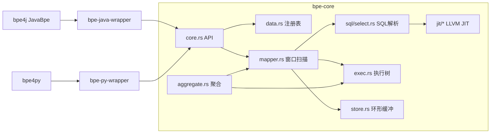

# Bamboo Pipe Engine - 全局设计文档

> 生成日期：2026-08-15（full-analysis / code-deconstruct，基于当前源码重写）

## 1. 项目概述

### 1.1 定位

**Bamboo Pipe Engine (BPE)** 是一个高性能单表流式数据处理引擎：
- **SQL 驱动**：SQL 语法定义数据过滤与字段提取规则
- **JIT 编译**：WHERE 条件经 LLVM-19 编译为原生机器码
- **单表架构**：仅支持单表 SELECT，不支持 JOIN/多表
- **多语言绑定**：Rust（原生）/ Java（JNI）/ Python（PyO3）

### 1.2 核心目标

| 目标 | 设计指标 | 现状 |
|------|----------|------|
| 延迟 | 纳秒级 | 窗口未回绕时 ~百 ns 级（实测 3000 条 release 运行 ~50ms 含 JIT） |
| 吞吐 | 百万级记录/秒/核心 | 单线程设计可达，回绕后坍缩 |
| 内存 | 固定大小、无动态分配 | 回调路径无分配（亮点）；定义期大量泄漏 |
| API | 简洁稳定 | 8 个 Rust API + JNI/PyO3 镜像 |

## 2. 系统组成

| 成员 | 类型 | 说明 |
|------|------|------|
| bpe-core | Rust 库 | 核心引擎（~4150 行） |
| bpe-java-wrapper | Rust cdylib + JNI | Java 绑定（~400 行） |
| bpe4j | Java（Maven） | Java 侧封装（~1040 行） |
| bpe-py-wrapper | Rust + PyO3 | Python 绑定（~176 行） |
| bpe-test | Rust 集成测试 | 18 个性能测试 |
| bpe-sample | Rust 示例 | 使用样例 |

依赖：inkwell 0.7.1（LLVM-19）、sql-parse 0.24、log4rs、hashbrown、globalvar、core_affinity、strum、config

## 3. 架构视图

### 3.1 组件图



### 3.2 数据流

见 `core_data_flow.md`（new_data → 环形缓冲 → JIT 过滤 → 字段求值 → 回调/聚合）。

## 4. 设计要点

### 4.1 性能设计（正确且有效）

1. **连续内存环形缓冲**：单次分配、顺序访问、prefetch 友好
2. **固定记录布局**：8 字节列对齐、偏移预计算
3. **JIT 过滤**：零解释开销
4. **热路径内联**：大量 #[inline]
5. **无锁单线程**：确定性延迟

### 4.2 设计缺陷（见 arch_design_summary.md 与 review 报告）

1. **窗口回绕坍缩**（已验证）：>2048 条后每次只处理 1 条
2. **聚合语义错乱**（已验证）：跨调用累积、二次增长、结果按 stream 列存储
3. **身份体系断裂**：mapper map key 与查询 key 不一致、aggregate 返回 Some(1)
4. **UB/panic 密集**：get_mut 别名 UB、未初始化读、OOB get_unchecked、外部输入 unwrap
5. **生命周期缺失**：stop() 空实现、全量泄漏

## 5. 配置设计

```toml
dev_mode = true    # true: 控制台+文件日志; false: 仅文件日志
vec_size = 1048576 # 环形缓冲总字节（须为 2 的幂）
record_size = 512  # 单记录步长（≤8192）
log_dir = "/tmp"   # 日志目录
```

环境变量：BPE_HOME（配置文件根目录）。

## 6. 安全设计

| 层面 | 现状 |
|------|------|
| 输入校验 | 不足：data_len 无上限校验、列名 unwrap、除零未防 |
| 内存安全 | unsafe 密集，多处 UB 风险（get_mut 别名、未初始化读） |
| 失败模式 | 定义期失败仅 warn+None；运行期失败 panic→abort（release） |
| 跨语言 | JNI 回调异常仅 warn；Java 侧 MPSC 队列有界（10240） |

## 7. 测试与验证

- 测试类型：SQL 解析（lib_test_XX）、性能测量（test_XXX，重复模板）
- 测试缺陷：**无结果断言**（只测耗时）；不覆盖回绕边界；不覆盖异常输入
- 基准：criterion（benchmarks1/2），filter / filter+aggregate 两场景

## 8. 综合评估（摘要）

| 维度 | 评价 |
|------|------|
| 设计 | 分层清晰、性能思路正确；全局状态与身份体系有根本缺陷 |
| 性能 | 设计可达标；回绕缺陷使长期运行退化为 1 条/次 |
| 安全 | 多处 UB 与 panic；对宿主进程（JVM）构成 abort 风险 |
| 代码 | 注释充分、风格统一；测试无断言、大量复制 |
| 重复度 | 31.8%（集中在测试/基准脚手架） |
