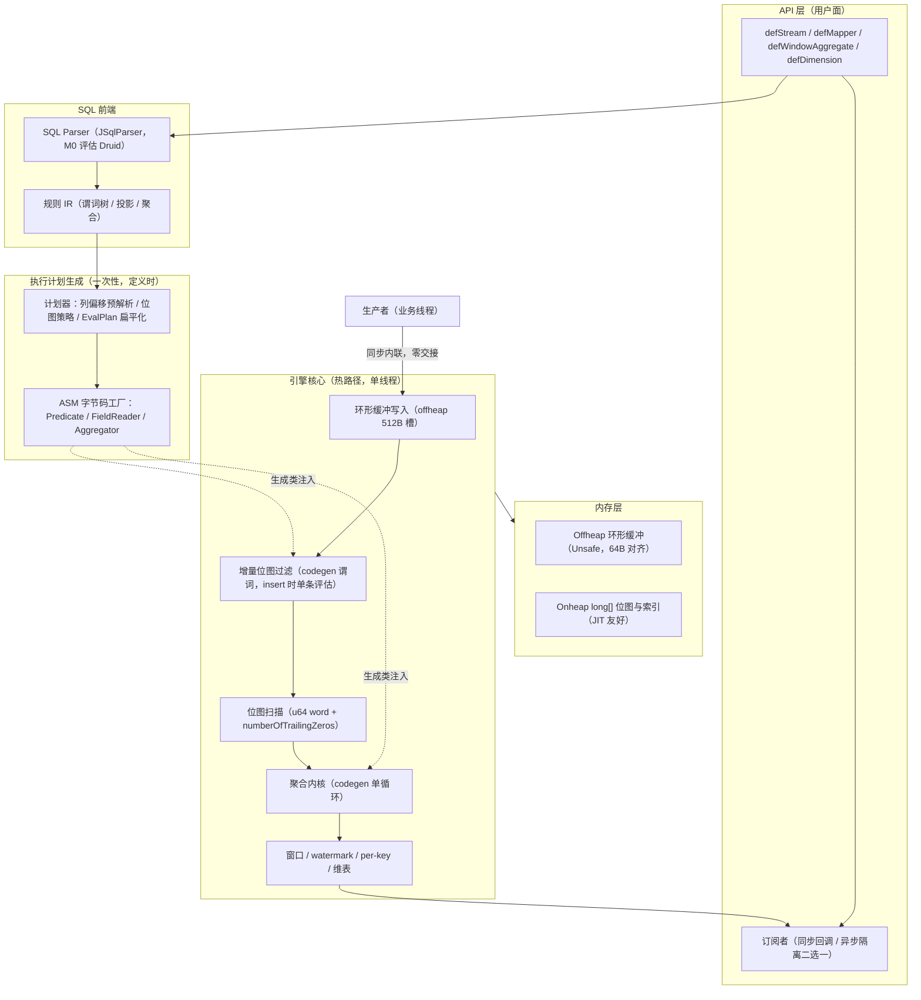
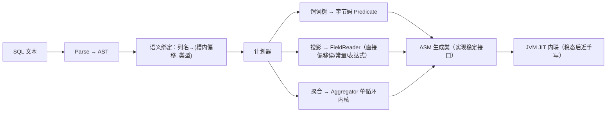
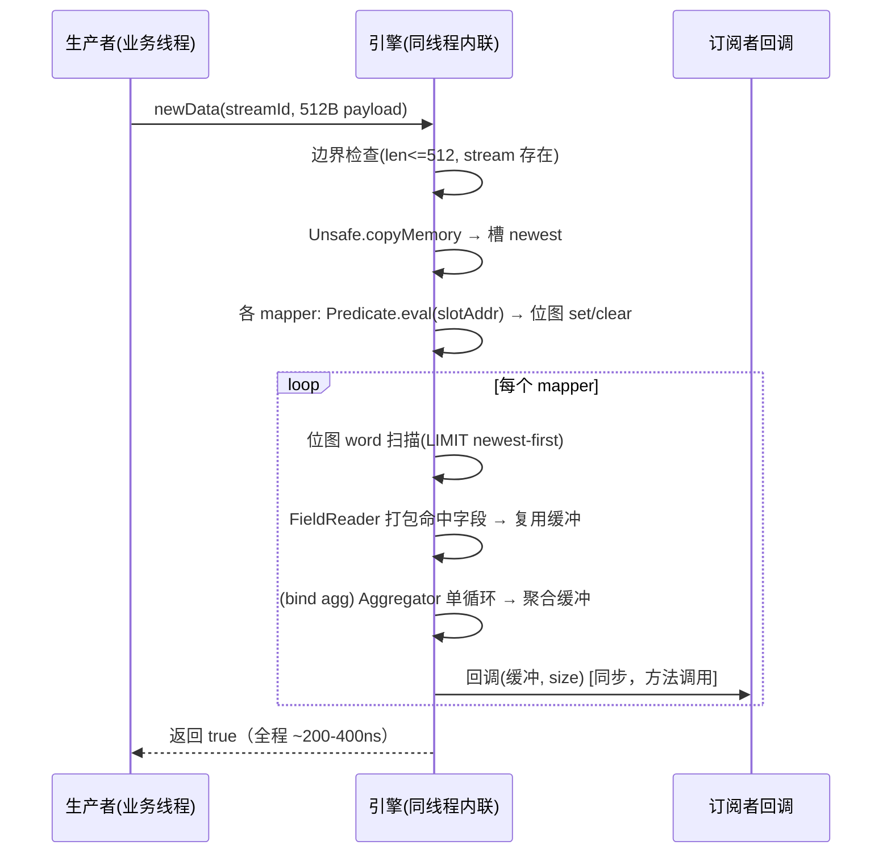
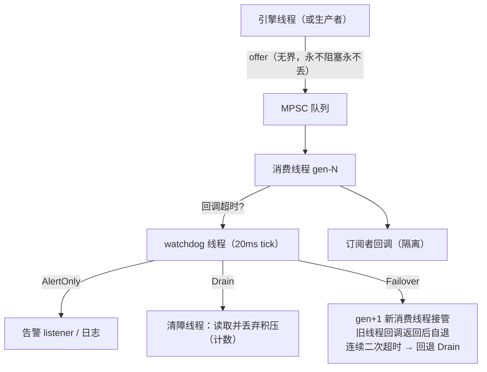

# jbpe 模块设计文档（Java + Offheap + Unsafe + SQL Parser + ASM）

- **日期**：2026-08-31
- **状态**：设计评审稿（未排期）
- **定位**：BPE 的纯 Java 孪生内核，消除跨语言边界税，目标 Esper 同量级
- **参照系**：bpe（Rust）语义平移；Esper 7.1（172-240ns）路线验证

---

## 1. 背景与动机

### 1.1 JNI 税的量化事实

bpe（Rust）经 JNI 嵌入 Java 的实测（2026-08-31，JMH）：

| 路径 | 延迟 | 说明 |
| --- | --- | --- |
| Rust 内核本体 | 78-133ns | JIT 过滤/聚合，快于 Esper |
| Java 全链路（含 2×JNI、2×线程交接、2×数组拷贝） | ~1.35µs | 慢于 Esper（172-240ns）约 6-8× |
| Esper 7.1 同场景 | 172-240ns | 零边界：同 JVM 方法调用 |

结论：**内核优势（~100ns 级）无法覆盖边界税（~1.2µs 级）**。唯一出路是不过界。

### 1.2 为什么纯 Java 可行

1. Esper 用反射/代码生成路线已证明 172ns 可达
2. ASM 运行时字节码生成 + JVM JIT 二次编译 = 事实上的"双层 JIT"，与 LLVM JIT 同构
3. bpe 的核心设计（定长记录槽、增量位图、预解析偏移）与语言无关，可整体平移
4. Rust 版 roadmap A 的"Unsafe 直读四条红线"在纯 Java 里天然消失——同一 JVM 内没有边界

### 1.3 与 bpe（Rust）的关系

- **非替代，是孪生**：同一 SQL 方言、同一 512B 记录布局（跨进程可 mmap 互通）、共享 golden 测试语义
- Rust 版仍是性能天花板（78-133ns vs 目标 ≤200ns）与 Python/原生嵌入主力
- jbpe 占 Java 生态位：对标并超越 Esper，卖点 = 特化风控语义 + 无界不丢交付 + watchdog 自愈

---

## 2. 总体架构



---

## 3. 核心设计

### 3.1 内存布局（offheap）

| 区域 | 位置 | 布局 | 说明 |
| --- | --- | --- | --- |
| 记录环形缓冲 | offheap | 2^N 槽 × 512B，槽内列按 8B 偏移 | 与 Rust 版逐字节兼容；Unsafe.getLong 直读 |
| 命中位图 | **onheap** | `long[]`，1 bit/槽 | 堆内数组 JIT 优化最佳；不参与订阅者直读 |
| 聚合输出缓冲 | onheap | 定长 long[]/double[] | 免分配复用 |
| 维表 | onheap | `Long2LongOpenHashMap`（fastutil）或 ConcurrentHashMap | 只读快照 + 版本号（平移 Rust dim_version） |

**对齐红线**：offheap 起址必须 64B 对齐（`allocateMemory` 仅保证 malloc 对齐，需手动 round-up），槽长 512B 保持整除，杜绝非对齐读陷阱（Rust 版 align=1 的历史教训）。

**端序契约**：全链路 `Unsafe.getLong`（native LE）读写，与 Rust 版一致；引擎启动时 canary 自检（见 6.4）。

### 3.2 SQL 前端选型

| 候选 | 优势 | 劣势 | 结论 |
| --- | --- | --- | --- |
| **JSqlParser** | 轻量中立、AST 完整、无生态捆绑 | 方言覆盖一般 | **首选（M0 评估）** |
| Druid SQL Parser | 生产级 lexer、AST 丰富 | 依赖较重（核心 jar ~2MB） | 备选 |
| Calcite | 全家桶（解析+优化+执行） | 过重，优化器与我们计划器职责冲突 | 否决 |

方言约束与 Rust 版对齐：单表 SELECT/WHERE/LIMIT、`_` 前缀函数、`_dim_has/_dim_get`，解析失败 fail-fast。

### 3.3 执行计划与 ASM 生成

定义时一次性完成，热路径零反射零装箱：



**JIT 友好性铁律**（codegen 必须遵守，否则字节码生成优势归零）：

1. 生成类实现**单态稳定接口**（Predicate/FieldReader/Aggregator），调用点单态内联
2. 方法体小而专（一个谓词一个类，避免巨型 switch）
3. 全程原始类型（long/double），零装箱、零变长参数
4. 循环内零调用（除 Unsafe intrinsics——`getLong` 被 JIT 识别为 intrinsic，直译单条 load 指令）

### 3.4 热路径（与 Rust 版逐点对应）

| Rust bpe 机制 | jbpe 对应 | 性能注解 |
| --- | --- | --- |
| insert + 512B memcpy | Unsafe.copyMemory 到槽址 | intrinsic |
| JIT filter 每记录一次 | codegen Predicate.eval(slotAddr) | JIT 内联后 = 一串 load/cmp/jmp |
| hitmap 位图 u64 扫描 + TZCNT | `Long.numberOfTrailingZeros` | JIT intrinsic → tzcnt 指令 |
| FieldReader 直读偏移 | codegen 直接 getLong(addr+off) | 同构 |
| 聚合 LLVM 单循环 + phi | codegen Aggregator 单循环，累加器=局部变量 | JVM JIT 擅长模式 |
| LIMIT newest-first 语义 | 位图从新端反向扫描 | 语义平移 |

### 3.5 线程模型与交付（与 Rust 版的关键分叉）

Rust 版因跨语言回调必须异步；jbpe 回调即 Java 方法调用，**默认同步同线程（Esper 模式）**：

| 模式 | 语义 | 适用 |
| --- | --- | --- |
| **SYNC（默认）** | 生产者线程内联执行 insert→filter→aggregate→回调，零交接 | 极低延迟；回调必须轻 |
| ASYNC | 无界 MPSC 队列（jctools）+ 专职消费线程 + watchdog 三策略（Drain/Failover/AlertOnly 整体平移） | 回调重/I-O；隔离 |

ASYNC 模式的无界不丢、watchdog、告警 listener 语义与 Rust egress 完全同构，此处不重复设计。

### 3.6 窗口 / watermark / per-key / 维表

纯数据结构逻辑，语义逐条平移 Rust 版（window.rs 语义表）：

- Tumbling/Sliding，事件时间（ts 列）或处理时间
- watermark = max_seen_ts - lag_ms，落后记录丢弃；空窗照常触发（size=0）
- wall-clock 兜底触发（空闲窗口按时钟关闭）
- per-key：窗口内按 key 列分组，行布局 `[key][field0..N]` 一回调交付
- 维表 `_dim_has/_dim_get`：只读快照 + 版本号，版本变更全量重算位图（与 Rust refresh_all_hitmaps 同构）

---

## 4. 关键流程

### 4.1 事件处理主流程（SYNC 模式）



### 4.2 ASYNC 模式交付与 watchdog



### 4.3 谓词字节码生成（codegen 内部逻辑）

```text
输入：WHERE amount > 100000 AND _abs(risk) > 3
语义绑定后：
  amount → (offset=16, long), risk → (offset=24, long)

生成的 eval(long slotAddr) 逻辑（伪代码，实际为字节码）：
  v0 = unsafe.getLong(slotAddr + 16)
  if v0 <= 100000: return false
  v1 = unsafe.getLong(slotAddr + 24)
  a0 = java.lang.Math.abs(v1)        // intrinsic
  return a0 > 3

ASM 装配要点：
  - 每比较一条 jump 指令，短路求值
  - 标量函数映射 intrinsic 白名单（abs/sqrt/min/max...），
    白名单外函数 → 降级为接口调用并记入"非内联预算"告警
  - 布尔列(i8) 提升为零开销 i64 比较（Rust 版 ce2700e 语义）
```

### 4.4 聚合内核生成

```text
输入：SELECT _count(qty), _suml(qty), _avg(price) ... LIMIT n
生成的 aggregate(slotAddrBase, count, step, outBase) 逻辑：
  acc_sum = 0; acc_cnt = 0; acc_fsum = 0.0
  for i in 0..count:                    // 单循环多累加器
      a = base + i * step
      acc_cnt  += 1
      acc_sum  += getLong(a + off_qty)
      acc_fsum += getDouble(a + off_price)
  out[0] = acc_cnt; out[1] = acc_sum; out[2] = acc_fsum / acc_cnt
  // stddev/variance: Welford 三状态(count,mean,m2)同样单循环
  // first/last: 直读首末槽，无循环
```

### 4.5 位图扫描（LIMIT newest-first）

```text
scan(mapper, out) :
  words 从最新槽所在 word 反向遍历：
      w = bitmap[wordIdx] & 头部掩码
      while w != 0 and n < limit:
          bit = numberOfTrailingZeros(高位侧)   // 反向用 highestOneBit 语义
          slot = wordIdx*64 + bit
          if slot < maxRecords: FieldReader 打包槽 → out; n++
          w &= ~(1 << bit)
  空 word O(1) 跳过 —— 与 Rust loop_filter 同构
```

---

## 5. 性能预算（目标，M4 对标验证）

| 场景 | Esper 7.1 | bpe-Rust 内核 | **jbpe 目标** | 依据 |
| --- | --- | --- | --- | --- |
| 纯过滤（6 条件） | 240ns | 133ns | **≤200ns** | 同 codegen 路线 + 特化直读 |
| 过滤+5 计算字段 | 222ns | 49ns | **≤150ns** | FieldReader 直读 |
| 窗口聚合（len 10） | 172ns | 78ns | **≤150ns** | 单循环多累加器 |
| 全链路交付（同步） | ~172-240ns | 1350ns(JNI) | **≤400ns** | 零边界零交接 |

冷启动：前 ~1 万次调用为解释/C1 执行（慢 5-20×），提供预热开关（定义后自动灌入哑数据预热至 C2）。

---

## 6. 风险与红线

| # | 风险/红线 | 对策 |
| --- | --- | --- |
| 1 | Unsafe 在新 JDK 收紧 | 目标 JDK8（对齐 bpe4j 现状）；预留 VarHandle/MemorySegment(Panama) 适配层接口，访问统一走 MemoryAccess 门面 |
| 2 | ASM 字节码 bug 难调试 | 生成时可选 dump（Textifier 输出伪源码）；golden 用例集双实现共享（同一 SQL 在 bpe/jbpe 结果必须逐字节一致） |
| 3 | JIT 未预热抖动 | 预热开关；JMH 对标必须区分冷/热两档报告 |
| 4 | GC 干扰热路径 | 热路径零分配（复用缓冲）；位图/索引堆内长存活进老年代；记录数据 offheap 不参与 GC |
| 5 | 订阅者直读生命周期 | SYNC 模式回调期间槽数据保证有效（同线程不覆盖）；ASYNC 模式交付拷贝快照（与 Rust egress 同语义） |
| 6 | 端序漂移 | canary 握手：启动写魔数样本+已知布局，自检失败拒绝启动（Rust roadmap A 机制平移） |
| 7 | 双实现语义漂移 | golden 测试集单一事实源：SQL+输入+期望输出三元组，CI 双跑比对 |

---

## 7. 里程碑

| 阶段 | 内容 | 验收 |
| --- | --- | --- |
| M0 | 骨架：offheap 环形缓冲 + Unsafe 门面 + canary + SQL 解析选型 | 读写一致性/对齐/端序自检全过 |
| M1 | filter codegen + 位图扫描 + SYNC 交付 | 纯过滤 JMH ≤200ns；golden 过滤用例全绿 |
| M2 | FieldReader + 聚合内核（含 stddev/Welford） | 聚合场景 ≤150ns；golden 聚合用例全绿 |
| M3 | 窗口/watermark/per-key/维表 | golden 窗口用例全绿；空窗/迟到/兜底触发语义一致 |
| M4 | ASYNC 模式 + watchdog 三策略 + Esper 对标报告 | 与 Esper 同场景 JMH 对比，全场景 ≥1×（目标 >1×） |

依赖坐标：ASM 9.x、JSqlParser（M0 评估）、jctools（ASYNC）、fastutil（可选）、JMH（test）。

---

## 8. 决策留痕

- 本设计为"上策"路线（完整孪生内核）；若 M0-M1 验证 codegen 性能不达标（>300ns），及时止损回退"下策"（bpe-Rust + Unsafe 直读），沉没成本控制在骨架+filter 层
- 记录于 memrec：2026-08-31 用户决策"换个道，建 jbpe"
